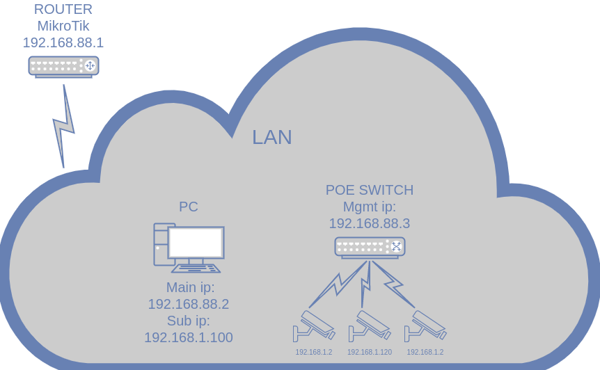

 _ _  _ _    _ _  _  _  _  _  _  _
(_(_|| | |  | | |(_|| |(_|(_|(/_| 
                          _|    

- [Вступление](#Вступление)
- [Описание](#Описание)
    - [Что настраиваем на камерах?](#Что-настраиваем-на-камерах)
    - [Какие модели камер можно настроить?](#Какие-модели-камер-можно-настроить)
    - [Обновление прошивки](#Обновление-прошивки)
- [Установка](#Установка)
- [Как пользоваться](#Как-пользоваться)
- [References](#References)

## Вступление:

Специалистам в компании где я работаю часто приходится настраивать большое количество ip камер. По дефолту они имеют статические адреса и необходимо заходить на каждую камеру и выполнять одни и те же рутинные операции: смена разрешения видео, указание ntp сервера, изменение пароля учётной записи, смена настроек сети и т.д.. Конечно же можно сохранить конфигурацию со всеми этими настройками и загружать их на следующие камеры, но не всегда это происходит корректно. Какие-то модели камер вообще не подхватывают сохраненную ранее конфигурацию и загружаются с настройками по-умолчанию.

Я решил облегчить их страдания чтобы они занимались другой более важной работой!

## Описание:
Моё решение основывается на использовании библиотеки [ONVIF Client Implementation in Python](https://github.com/yingchengpa/python-onvif2-zeep).

Для простого запуска весь код с помощью **pyinstaller** скопилирован в бинарный файл и распространен ввиде утилиты на рабочие станции сотрудников.

Предполагается, что компьютер с которого происходит настройка камеры, находится в одной с ними сети и имеет второй ip-интерфейс из той же сети как и у камеры.

<b>Схема</b>

Конфигурация камер заранее описывается в файлах json для конкретных моделей. Пример: [OMNY-miniBullet2EWDU.json](configs/cam/OMNY/OMNY-miniBullet2EWDU.json).

**На данный  момент утилита умеет:**
- обновлять камеру до последней рабочей версии прошивки (где работает коридорый режим и т.д.)
- настраивать одну камеру
- несколько в режиме настройки с помощью управляемого POE коммутатора
- настраивать одну или несколько камер, если запустить утилиту с **sudo** правами (*без использования управляемого POЕ коммутатора*)
- сбрасывать камеры к заводским настройкам
____
### Что настраиваем на камерах?
- Основной видеопоток (разрешение, качество, битрейт)
- Дополнительный видеопоток (разрешение)
- Убираем лишнюю системную информацию с видеопотока (оставляем только дату и время)
- Таймзона
- NTP сервер
- Создание дополнительного пользователя с правами только на просмотр
- Изменение пароля у пользователя admin
- Смена настроек сети на DHCP
____
### Какие модели камер можно настроить?

OMNY

OMNY A52N 36 
OMNY A52SN 36 
OMNY A55N 36 
OMNY A55SN 28 
OMNY A55SN 36 
OMNY-ViBe5EZWDU 
OMNY-miniBullet2EWDU 
OMNY-miniBullet5EWDU 
OMNY-miniDome2EWD12V 
OMNY-miniDome2EWDU 
OMNY-miniDome2M 
OMNY-miniDome2M12Vv3 
OMNY-miniDome2WDUv3 
OMNY-miniDome4WDU 
OMNY-miniDome5EU 
OMNY-miniDome5EUv2 
OMNY_A54N 
OMNY_A55N_28

DAHUA

DH-IPC-HDW2230TP-AS-0280B 
DH-IPC-HFW2231TP-ZS

