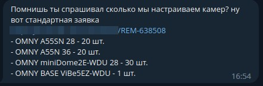

- [Вступление](#Вступление)
- [Описание](#Описание)
    - [Что настраиваем на камерах?](#Что-настраиваем-на-камерах?)
    - [Какие модели камер можно настроить?](#Какие-модели-камер-можно-настроить?)
    - [Обновление прошивки](#Обновление-прошивки)
- [Установка](#Установка)
- [Как пользоваться](#Как-пользоваться)
- [References](#References)

## Вступление:

### Какие модели камер можно настроить?

OMNY

OMNY A52N 36 
OMNY A52SN 36 
OMNY A55N 36 
OMNY A55SN 28 
OMNY A55SN 36 
OMNY-ViBe5EZWDU 
OMNY-miniBullet2EWDU 
OMNY-miniBullet5EWDU 
OMNY-miniDome2EWD12V 
OMNY-miniDome2EWDU 
OMNY-miniDome2M 
OMNY-miniDome2M12Vv3 
OMNY-miniDome2WDUv3 
OMNY-miniDome4WDU 
OMNY-miniDome5EU 
OMNY-miniDome5EUv2 
OMNY_A54N 
OMNY_A55N_28

DAHUA

DH-IPC-HDW2230TP-AS-0280B 
DH-IPC-HFW2231TP-ZS

